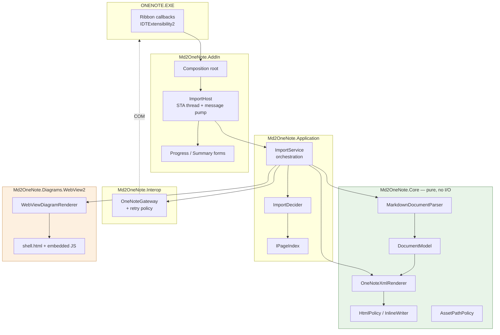
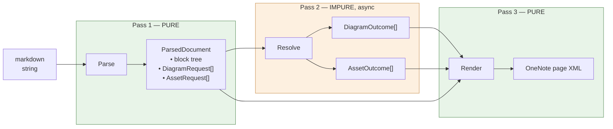
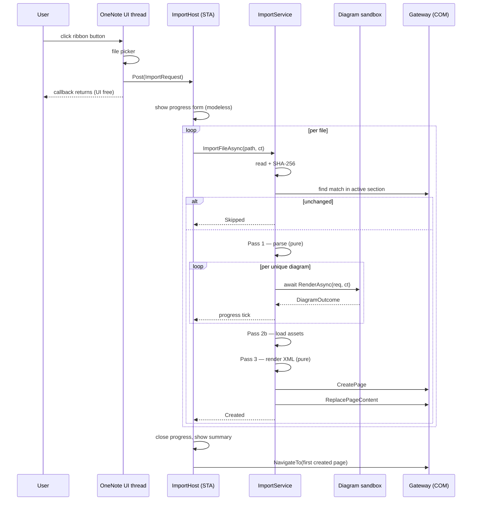
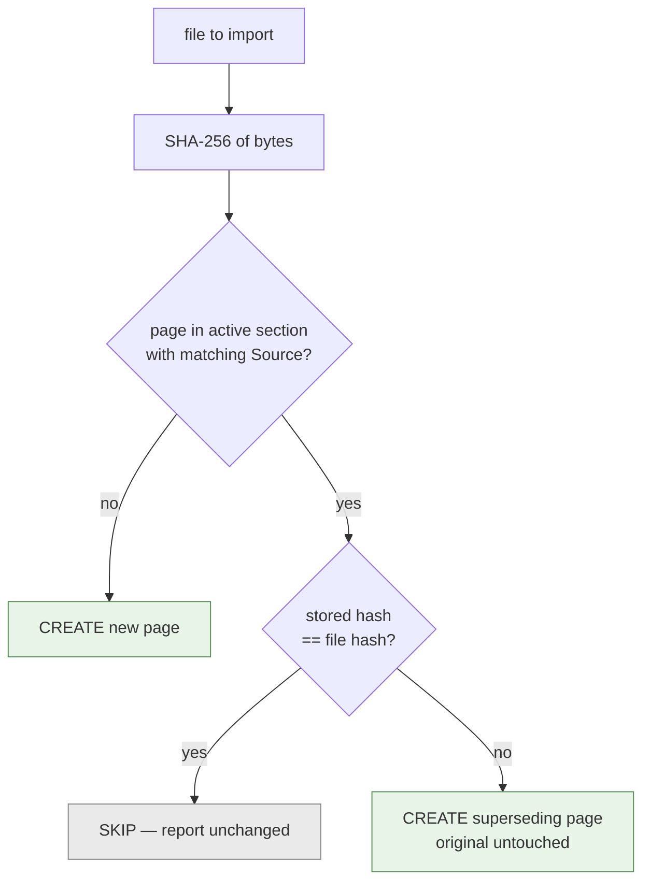
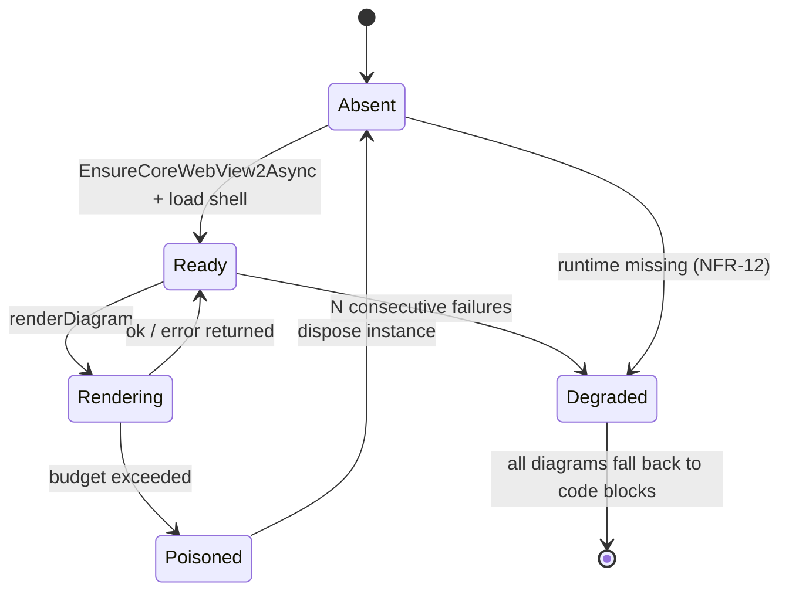

# Md2OneNote — System Design

Derived from `REQUIREMENTS.md` (authoritative for *what*) and `IMPLEMENTATION.md` (domain knowledge
for OneNote XML and interop). This document specifies structure, contracts, and control flow. It
does not contain implementation.

Language level is C# 7.3 (.NET Framework 4.8): no records, no nullable reference types, no switch
expressions. Signatures below respect that.

---

## 1. Design drivers

Four requirements shape the architecture more than anything else:

| Driver | Requirement | Structural consequence |
|---|---|---|
| Conversion must be testable headless | NFR-21 | Diagram rendering and file I/O are lifted *out* of conversion into a three-pass pipeline (§3). This is the central decision. |
| Never overwrite a user's page | FR-21 | No page lookup-and-rewrite path exists. The gateway can create and fill a new page; it has no "modify existing page" operation (§5). |
| Untrusted input | NFR-4…8 | A sanitization boundary in Core, a path policy on assets, and a network-isolated, disposable diagram sandbox (§9). |
| Must not appear hung; must be cancellable | FR-5, NFR-19 | A dedicated STA thread with its own message pump owns both the WebView2 and the import loop (§4). |

---

## 2. Component architecture



| Assembly | Responsibility | May reference |
|---|---|---|
| `Md2OneNote.Core` | Markdown → OneNote XML. Deterministic, side-effect free, no I/O, no COM, no UI. | Markdig, ColorCode |
| `Md2OneNote.Application` | Orchestration: the per-file pipeline, import decisions, progress and error aggregation. Depends only on interfaces. | Core |
| `Md2OneNote.Interop` | The only assembly that touches `Microsoft.Office.Interop.OneNote`. Retry, XML parsing of hierarchy, error translation. | Core (contracts) |
| `Md2OneNote.Diagrams.WebView2` | The diagram sandbox and its lifecycle. | Core (contracts), WebView2 |
| `Md2OneNote.AddIn` | COM registration, ribbon, thread host, WinForms UI, composition root. | all |

**Why `Application` is separate from `AddIn`:** NFR-22 requires the pipeline be exercisable without
OneNote hosting the code. With orchestration in its own assembly behind `IOneNoteGateway`, a test
harness runs the whole import against a fake gateway and a fake renderer. Folded into `AddIn`, that
becomes impossible without loading the COM shell, and the NFR-9 version matrix stops being
diagnosable.

---

## 3. The three-pass pipeline

Conversion cannot be pure if it renders diagrams mid-walk — rendering is async, impure, and needs a
browser. The pipeline splits at that seam.



Pass 1 walks the Markdig AST and emits a `DocumentModel` plus a list of *requests* — it does not
resolve them. Each request carries a stable key. Pass 2, owned by `ImportService`, satisfies the
requests. Pass 3 renders the model, looking outcomes up by key.

Consequences, all of which are the point:

- Golden-file tests feed pass 3 fabricated `DiagramOutcome`s (a 1×1 PNG, or a deliberate failure)
  and assert on XML. No WebView2, no OneNote, fully deterministic.
- Diagram failure handling (FR-14) is a *rendering* concern, exercised in unit tests, not something
  only reproducible by breaking a real browser.
- Deduplication (NFR-20) is trivial: requests with equal keys resolve once.
- Cancellation has a natural checkpoint between passes.

---

## 4. Threading and execution model

The constraint set is awkward: WebView2 needs a UI thread with a message pump; the progress form
must stay responsive; OneNote's COM object is apartment-threaded; and the ribbon callback must
return promptly or OneNote appears frozen.

**Resolution:** the add-in owns one dedicated STA thread (`ImportHost`) running a WinForms message
pump for the process lifetime. That thread owns the WebView2 instance, the progress form, and the
import loop. Because `Application.Run` installs a `WindowsFormsSynchronizationContext`, `await`
continuations post back to the pump — so the import loop can be `async`, and the pump stays free to
paint progress and service the Cancel button while a diagram renders.



Rules:

- The ribbon callback never blocks. It validates, collects paths, posts, returns.
- A second import request while one is running is rejected with a message, not queued.
- Every COM call is marshalled from the host thread to OneNote's apartment by the runtime; this is
  the source of `RPC_E_SERVERCALL_RETRYLATER` and is handled by the gateway's retry policy, not by
  callers.
- `async void` appears only in event handlers, per `IMPLEMENTATION.md` §14.
- On add-in shutdown the host thread is signalled, the WebView2 disposed, and the pump exited.

---

## 5. Interface definitions

### 5.1 Core — pure

```csharp
namespace Md2OneNote.Core
{
    public sealed class MarkdownDocumentParser
    {
        ParsedDocument Parse(string markdown, ParseOptions options);
    }

    public sealed class ParsedDocument
    {
        string SuggestedTitle { get; }              // front matter > leading H1 > null
        DocumentModel Body { get; }
        IReadOnlyList<DiagramRequest> Diagrams { get; }
        IReadOnlyList<AssetRequest> Assets { get; }
        IReadOnlyList<Diagnostic> Diagnostics { get; }
    }

    public sealed class DiagramRequest
    {
        string Key { get; }                          // sha256(language + '\0' + source)
        string Language { get; }
        string Source { get; }
    }

    public sealed class AssetRequest
    {
        string Key { get; }
        string RawPath { get; }                      // exactly as written in the Markdown
        string AltText { get; }
    }

    public sealed class OneNoteXmlRenderer
    {
        string Render(ParsedDocument document, RenderInputs inputs);
    }

    public sealed class RenderInputs
    {
        string PageId { get; }                       // from the created page skeleton
        string Title { get; }
        PageMetadata Metadata { get; }
        IReadOnlyDictionary<string, DiagramOutcome> Diagrams { get; }
        IReadOnlyDictionary<string, AssetOutcome> Assets { get; }
        IStringCatalog Strings { get; }
    }
}
```

Outcome types are explicit success/failure carriers rather than exceptions, because a failure is a
*rendered artifact* (FR-14), not an error path:

```csharp
public sealed class DiagramOutcome
{
    bool Succeeded { get; }
    byte[] Png { get; }                 // null when failed
    int WidthPx { get; }                // capture size; renderer halves it for one:Size
    int HeightPx { get; }
    string FailureMessage { get; }      // localized, shown under the fallback code block
}

public sealed class AssetOutcome
{
    bool Succeeded { get; }
    byte[] Bytes { get; }
    string Format { get; }              // "png" | "jpg" | "gif"
    int WidthPx { get; }
    int HeightPx { get; }
    string FailureMessage { get; }
}
```

### 5.2 Boundaries the Application layer depends on

```csharp
public interface IOneNoteGateway
{
    SectionRef GetActiveSection();                        // throws NoActiveSectionException
    IReadOnlyList<PageRef> ListPages(string sectionId);
    string GetPageXml(string pageId);
    string CreatePage(string sectionId);                  // returns new pageId
    void ReplacePageContent(string pageId, string pageXml);
    void NavigateTo(string pageId);
}

public interface IDiagramRenderer
{
    bool CanRender(string language);
    Task<DiagramOutcome> RenderAsync(DiagramRequest request, CancellationToken ct);
}

public interface IAssetSource
{
    AssetOutcome Load(AssetRequest request, string baseDirectory, AssetPolicy policy);
}

public interface IPageIndex
{
    PageMatch TryFind(string sectionId, string sourcePath);
    void Record(string sectionId, string sourcePath, string pageId, string sourceHash);
}

public interface IImportProgress
{
    void FileStarted(int index, int total, string path);
    void Step(string localizedMessage);
    void FileFinished(FileResult result);
}

public interface IStringCatalog { string Get(string key); }
```

Note what `IOneNoteGateway` deliberately lacks: any way to modify a page that was not just created.
FR-21 is enforced by the shape of the interface, not by discipline.

### 5.3 Orchestration

```csharp
public sealed class ImportService
{
    Task<ImportSummary> ImportAsync(
        IReadOnlyList<string> filePaths,
        ImportOptions options,
        IImportProgress progress,
        CancellationToken ct);
}

public sealed class FileResult
{
    string SourcePath { get; }
    FileOutcome Outcome { get; }        // Created | CreatedSuperseding | Skipped | Failed | Cancelled
    string PageId { get; }
    FailureReason Reason { get; }       // None | Unreadable | TooLarge | ParseError |
                                        // SectionUnavailable | OneNoteBusy | Internal
    string Message { get; }
    IReadOnlyList<Diagnostic> Warnings { get; }   // missing images, failed diagrams, dropped HTML
}
```

`ImportSummary` aggregates `FileResult`s. Warnings are per-file and non-fatal — a page still gets
created with placeholders (FR-10, FR-14).

---

## 6. OneNote XML generation

### 6.1 Style table

`IMPLEMENTATION.md` §5.1 warns that `QuickStyleDef` indices are not guaranteed. That concern
dissolves under this design: because every page is **created blank and filled in one shot**, the
renderer authors the entire `QuickStyleDef` block itself and therefore *chooses* the indices. They
are constants of our own making.

What Phase 0 must still establish is which style **names** OneNote recognizes as its own (so that
the style picker and outline view behave natively, per FR-8) and what those styles look like by
default. `StyleTable` is a single immutable map from semantic role (`H1`…`H6`, `Body`, `Quote`,
`Code`, `Cite`, `Title`) to index + definition, populated from Phase 0 findings and used by every
block writer.

### 6.2 Block writers

Dispatch on model node type; one writer per node kind, each producing `XElement`s. Cross-cutting
state lives in a `RenderContext`:

- **`NumberSequenceAllocator`** — a monotonic counter, one draw per ordered-list *instance*.
  Directly addresses the `numberSequence` collision pitfall; centralizing it means no writer can
  reintroduce the bug.
- **Nesting depth** — children go in `one:OEChildren` inside the parent `one:OE`, after its `one:T`.
- **Warning sink** — writers append `Diagnostic`s rather than throwing.

### 6.3 Inline rendering and escaping

The CDATA/escaping interaction is the most error-prone surface in the project, so it gets exactly
one implementation: `InlineWriter` builds the fragment through a small typed builder that
distinguishes *markup we emit* from *text the user wrote*. Text is HTML-escaped on the way in;
markup is appended verbatim; the assembled fragment is placed in CDATA without a second escaping
pass. No other component may construct `one:T` content.

Leading indentation is converted to `&nbsp;` at this layer, since it is the only place that knows
whether a character is user text or generated markup.

### 6.4 Raw HTML in Markdown

Markdig passes raw HTML through by default. Under NFR-4 the design rejects it:

| Input | Treatment |
|---|---|
| `HtmlBlock` | Dropped; a `Diagnostic` records the location |
| `HtmlInline` | Escaped and rendered as literal text |

Rationale: dropping is visible and safe, and inline escaping preserves author intent for the common
case of someone writing `<br>` or `<sup>`. Neither can produce active content, remote fetches, or
forged OneNote UI. This is a deliberate fidelity-for-safety trade, made because the tool is
published (§9).

### 6.5 Code blocks and images

Code blocks follow `IMPLEMENTATION.md` §5.2: single-cell shaded table, one `one:OE` per source
line, `&nbsp;` indentation, tokens colored by ColorCode where the language is recognized. Unknown
language → no highlighting, never a failure (FR-13).

Images emit `one:Size` at half the captured or intrinsic pixel dimensions for diagrams (the 2×
capture of `IMPLEMENTATION.md` §8.2), and scale down proportionally to the 660 px content width for
document images (FR-10, §9.1).

---

## 7. Page identity and the import decision

### 7.1 Metadata written to every created page

| `one:Meta` name | Content |
|---|---|
| `Md2OneNote.Source` | full source path |
| `Md2OneNote.Hash` | `sha256:<hex>` of source file bytes |
| `Md2OneNote.Version` | tool version that produced the page |
| `Md2OneNote.Imported` | ISO-8601 timestamp |

### 7.2 Decision flow



Both create branches are identical code paths differing only in title decoration. Nothing in the
product mutates an existing page.

### 7.3 Lookup strategy

Reading `one:Meta` requires page content, so a naive scan is one `GetPageContent` per page in the
section — seconds in a large section, on every import.

`IPageIndex` is therefore a **cache, never an authority**: a JSON file under `%LOCALAPPDATA%` keyed
by `(sectionId, sourcePath)`. A hit is confirmed with one `GetPageContent` on the candidate before
being trusted; if the page is gone, moved, or its metadata no longer matches, the entry is discarded
and the result is "no match" — which creates a new page. The failure mode of a stale cache is
therefore a duplicate page, never a lost one.

> **Phase 0 must check whether `one:Meta` is returned by `GetHierarchy(sectionId, hsPages, …)`.**
> If it is, section scanning costs a single COM call, `IPageIndex` collapses to a trivial
> implementation over that call, and the cache file is deleted from the design. This is the single
> highest-value unknown in the spike.

---

## 8. Diagram subsystem

### 8.1 Sandbox contract

One `WebView2`, created lazily on the host thread, reused across diagrams within an import.

- Shell is a single self-contained HTML document with all libraries inlined as embedded resources.
- JS entry point: `renderDiagram(lang, source, id)` → `{"ok":true,"w":720,"h":410}` or
  `{"ok":false,"error":"…"}`.
- Each render resets container state, so no diagram can observe or corrupt a previous one (NFR-6).
- Capture at 2× via `Bounds` + CSS `transform: scale(2)`, `CapturePreviewAsync(Png, …)`,
  `one:Size` at half.
- Mermaid: `{ startOnLoad: false, htmlLabels: false, securityLevel: 'strict' }` — `htmlLabels:false`
  is mandatory, since `foreignObject` does not rasterize reliably.

### 8.2 Runaway rendering

`ExecuteScriptAsync` cannot cancel a script that never returns; racing it against a timeout
abandons the task but leaves the renderer process spinning. The design therefore treats a timeout as
**instance poisoning**:



Per-diagram budget is a configured `TimeSpan` (default 10 s). On expiry the instance is disposed and
recreated for the next diagram; the offending diagram is reported as failed and rendered as a
fallback code block. After N consecutive failures the subsystem enters `Degraded` for the remainder
of the import and stops paying the recreation cost — the import still completes (FR-14, NFR-8).

### 8.3 Network isolation

Two independent layers, because either alone can be defeated by a mistake in the other (NFR-5):

1. A CSP in the shell: `default-src 'none'; script-src 'unsafe-inline'; style-src 'unsafe-inline'; img-src data:`.
2. A `WebResourceRequested` handler registered for `*` that fails every request not served from the
   embedded shell.

The user data folder is placed under `%LOCALAPPDATA%\Md2OneNote\`, never the install directory, so
the sandbox works without write access to Program Files.

### 8.4 Absence of the runtime

Detected once at first use. If missing, the registry resolves `NullDiagramRenderer`, whose
`CanRender` always returns false — every diagram takes the fallback path, and the summary states
plainly that diagram support is unavailable and why. Import of everything else is unaffected
(NFR-12).

### 8.5 Caching

Keyed by `DiagramRequest.Key`. In-memory for the import session satisfies NFR-20. A persistent
on-disk cache under `%LOCALAPPDATA%` is *designed for but not required in v1*: same key, LRU
eviction, invalidated by tool version. Deferred until Phase 4 measurements justify it (OQ-5).

---

## 9. Security design

| Threat | Control | Location |
|---|---|---|
| Script or active content reaching the page | Raw HTML blocks dropped, inline HTML escaped (§6.4) | `HtmlPolicy`, Core |
| Diagram source escaping the sandbox | `securityLevel: 'strict'`, state reset per render, no host object bridge | Shell, `Md2OneNote.Diagrams.WebView2` |
| Any outbound network request | CSP + `WebResourceRequested` deny-all (§8.3); no other component opens a socket | Diagram sandbox |
| Arbitrary local file embedded into a shareable page | `AssetPathPolicy` (below) | Core (policy) + `IAssetSource` |
| **UNC path triggering an NTLM credential leak** | UNC and non-local drives rejected unconditionally | `AssetPathPolicy` |
| Diagram bomb / infinite loop | Per-diagram budget with instance teardown (§8.2) | Diagram sandbox |
| Resource exhaustion | `ImportLimits`: max file size, max asset bytes, max diagrams per document, max total page bytes | `ImportService` |

**`AssetPathPolicy`** — pure, table-testable, and the one place path decisions are made:

| Path form | Default | Rationale |
|---|---|---|
| Relative, resolves under the Markdown file's directory | allow | The normal case |
| Relative with `..` escaping the base directory | allow, warn | `../shared/img.png` is legitimate and common; blocking it outright breaks real documents for a threat that absolute paths already cover better |
| Absolute local path | reject | A document that references `C:\Users\…` was not written for this machine |
| UNC (`\\host\share`) or mapped network drive | **reject, always** | Fetching it authenticates to an attacker-controlled host. Not configurable |
| Non-image extension, or content not matching a known image signature | reject | |
| Exceeds size cap | reject | |

Rejections produce a placeholder plus a warning (FR-10), never a silent omission and never an
exception.

---

## 10. Errors, progress, cancellation

- **Isolation** — each file is wrapped independently; an exception becomes a `FileResult` with
  `Failed` and a `FailureReason`, and the loop continues (FR-3).
- **Transactionality** — the page is created only after XML generation succeeds, and content is
  submitted in a single `ReplacePageContent`. A mid-build failure leaves no page (NFR-1).
- **Retry** — `OneNoteGateway` wraps every COM call: 3 attempts, 300 ms backoff, on
  `RPC_E_SERVERCALL_RETRYLATER` (`0x8001010A`) only. Exhaustion surfaces as `OneNoteBusy`. Callers
  never see a raw `COMException`.
- **Cancellation** — one `CancellationTokenSource` owned by the progress form. Checked between
  files, between diagrams, and passed into `RenderAsync`. Pages already created are kept and
  reported (FR-5).
- **Never fatal to the host** — `OnConnection`, `OnDisconnection`, and every ribbon callback are
  fully wrapped. An unhandled exception is logged and swallowed rather than propagated into OneNote
  (NFR-2).

Logging is at boundaries only: ribbon callbacks, gateway calls, diagram renders — to
`%LOCALAPPDATA%\Md2OneNote\log.txt`, size-capped with one rollover. The summary form offers "Copy
diagnostics," which puts the log tail plus version and environment stamp on the clipboard (NFR-17).

---

## 11. Localization

Every user-visible string resolves through `IStringCatalog`, including strings emitted *into page
content* — the footnote section heading among them, which `IMPLEMENTATION.md` §7 hardcodes as
"Notes" (NFR-11). Core receives the catalog through `RenderInputs` rather than reading resources
directly, keeping it pure and letting golden-file tests pin an invariant catalog.

The ribbon binds to `idMso="TabInsert"`, which is locale-independent. Style *names* in
`QuickStyleDef` are schema tokens, not UI strings, and are not localized — Phase 0 should confirm
this on a non-English build if one is reachable.

---

## 12. Deployment and recovery

Registration follows `IMPLEMENTATION.md` §10: per-user `HKCU` add-in key and per-user CLSID
registration, no elevation. AnyCPU.

The design addition is **NFR-3**. When OneNote disables the add-in after a startup failure, it sets
`LoadBehavior=2` and adds an entry to `Resiliency\DisabledItems` — and a disabled add-in cannot
repair itself, because it never loads. The recovery path is therefore a **separate small signed
executable** shipped alongside, which clears the `DisabledItems` entry, resets `LoadBehavior=3`, and
reports what it found. It is reachable from the Start menu and named for what it does, so support
guidance is "run Repair Md2OneNote" rather than "open regedit."

The installer (Inno Setup, per-user) invokes the same registration logic as `tools/register.ps1`,
and both refuse to run while `ONENOTE.EXE` is alive. Uninstall is verified by clean-VM registry and
filesystem diff (NFR-14).

---

## 13. Design decisions and rejected alternatives

| # | Decision | Rejected alternative | Why |
|---|---|---|---|
| D1 | Three-pass pipeline splitting resolution out of conversion | Single-pass renderer with an injected async diagram callback | An async callback makes the renderer async and untestable without a fake browser. The split buys NFR-21 outright. |
| D2 | Gateway cannot modify existing pages | General `UpdatePageContent(pageId, xml)` | Makes FR-21 structural. A future contributor cannot accidentally add an overwrite path without changing the interface. |
| D3 | Renderer authors its own `QuickStyleDef` indices | Read indices from the created page skeleton | We create blank pages, so we own the defs. Removes the "indices not guaranteed" risk entirely. |
| D4 | Page index is a cache, verified before trust | Authoritative local database of imported pages | A database desynchronizes from a notebook the user edits freely. A verified cache degrades to "create a duplicate," which is the safe direction. |
| D5 | Single dedicated STA thread hosts both WebView2 and the import loop | Background thread + marshalling each render to the UI thread | Marshalling per diagram reintroduces the freeze it was meant to avoid. One pump keeps progress live and cancellation honest. |
| D6 | Timeout ⇒ dispose and recreate the WebView2 | Race `ExecuteScriptAsync` against `Task.Delay` and continue | A runaway script keeps consuming CPU and can corrupt later renders. Only teardown actually reclaims it. |
| D7 | Raw HTML dropped, inline HTML escaped | Sanitize with an allow-list and pass through | An allow-list is a permanent maintenance liability in a published tool. The fidelity cost is small and visible. |
| D8 | `..` allowed with a warning; UNC rejected unconditionally | Confine strictly to the base directory | Strict confinement breaks legitimate shared-asset layouts while the genuinely dangerous case is the network path. |
| D9 | Five assemblies including a separate `Application` | Three, per `IMPLEMENTATION.md` §4 | NFR-22 needs orchestration runnable without the COM host. One extra project boundary is the whole cost. |

---

## 14. Feeds into Phase 0

The spike in `IMPLEMENTATION.md` §11 stands unchanged, plus three questions this design raised:

1. **Does `GetHierarchy(sectionId, hsPages, …)` return `one:Meta` for pages?** Determines whether
   `IPageIndex` needs a cache at all (§7.3). Highest-value unknown.
2. **Which `QuickStyleDef` `name` values does OneNote treat as native styles?** Determines whether
   FR-8 is achievable as specified, i.e. whether the outline view and style picker actually
   recognize the output.
3. **What does `CreateNewPage` + `piBasic` return in the skeleton**, and which attributes must be
   preserved on the round trip.

---

## 15. Traceability

| Requirement | Realized by |
|---|---|
| FR-1…FR-6 | §4 host thread, `ImportService`, progress form |
| FR-7…FR-16 | §3 pipeline, §6 XML generation |
| FR-17…FR-21 | §7 identity and decision flow; `IOneNoteGateway` shape |
| NFR-1, NFR-2 | §10 transactionality and boundary wrapping |
| NFR-3 | §12 separate repair executable |
| NFR-4…NFR-8 | §6.4, §8.2, §8.3, §9 |
| NFR-9…NFR-12 | §12 registration, §8.4 degradation, §11 localization |
| NFR-13…NFR-17 | §12 deployment, §10 diagnostics |
| NFR-18…NFR-20 | §4 responsiveness, §8.5 caching |
| NFR-21, NFR-22 | §3 pure passes, §2 `Application` assembly |

---

## 16. Next step

Design only — no implementation. Recommended order:

1. **Phase 0**, extended with §14. Question 1 can delete a component from this design; run it first.
2. Revise §6.1 and §7.3 against the dump.
3. `/sc:workflow` to sequence the phases against this structure, or `/sc:implement` starting with
   `Md2OneNote.Core` — it has no dependencies on the unknowns except the style table.
