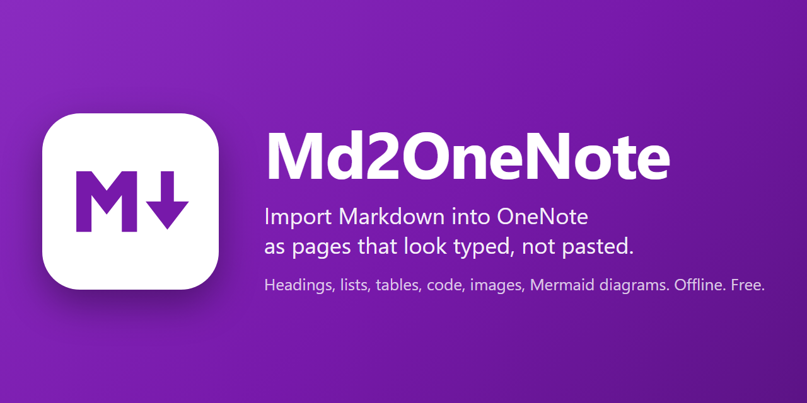

# Md2OneNote

[](https://github.com/suchst/Md2OneNote/actions/workflows/ci.yml)
[](https://github.com/suchst/Md2OneNote/releases)
[](LICENSE)
[](https://github.com/sponsors/suchst)



Md2OneNote is a small add-in for OneNote on Windows. It adds one button to the Insert tab. You
pick one or more `.md` files, and each becomes a page in the current section: real OneNote
headings and lists, tables, highlighted code, embedded images, and Mermaid diagrams rendered to
crisp pictures. Everything happens on your machine; the add-in never touches the network.

## What it does

- **Headings, paragraphs, emphasis, links, block quotes** become OneNote's own styles, so the
  outline view, the style picker and search all work as if you had typed the page.
- **Bulleted, numbered, nested and task lists** map to OneNote lists and check-box tags.
- **Tables** keep their header row.
- **Code blocks** are shaded, keep their indentation, and are syntax-highlighted.
- **Images** referenced by a relative path (``) are embedded at life size and
  scaled down to fit the page width.
- **Mermaid diagrams** (` ```mermaid ` fences) are rendered offline at 2x resolution and placed as
  pictures. A diagram that does not render stays in the page as code, with the reason underneath.
- **Re-import is safe.** A page the add-in created is never overwritten. Importing a file again
  is skipped when the file has not changed, and creates a second, dated page when it has. One
  click lets you import an unchanged file again anyway.
- **Front matter** (`title:`) names the page; otherwise the first heading or the file name does.

What it deliberately does not do: sync folders, follow wiki-links, edit pages it did not just
create, or run from the command line. The reasoning is in [docs/REQUIREMENTS.md](docs/REQUIREMENTS.md).

## Requirements

| | |
|---|---|
| Windows | 10 or 11 |
| OneNote | OneNote for Windows (the desktop app: Microsoft 365, or 2016 and later). Not "OneNote for Windows 10" from the Store, and not the web app. |
| .NET Framework 4.8 | Included in Windows 10 since version 1903 and in every Windows 11. |
| WebView2 Runtime | Needed only for diagrams. Included in Windows 11 and most Windows 10 installs. Without it the import still works and diagrams appear as code. |

The add-in installs per user and needs no administrator rights.

## Install

1. Close OneNote.
2. Download `Md2OneNote-<version>-setup.exe` from the
   [latest release](https://github.com/suchst/Md2OneNote/releases/latest) and run it. It installs
   for the current user only, under `%LOCALAPPDATA%\Md2OneNote`, and asks for no administrator
   rights.
3. Start OneNote. On the **Insert** tab you will find a **Markdown** group with **Import Markdown**
   and **About**.

Preview releases are not code-signed yet, so Windows SmartScreen may show "Windows protected your
PC"; choose *More info* and *Run anyway*. The `SHA256SUMS` file on the release page lets you check
the download.

**Without the installer:** the release also has a zip. Unpack it anywhere, close OneNote, and run
`register.ps1 -Install` from the unpacked folder in PowerShell (`-Uninstall` removes it again).

**From source:** clone the repository and run `.\tools\register.ps1 -Install`; it builds first.

To remove the add-in, use *Apps & features* (or `register.ps1 -Uninstall` for a script install).
Every registry key the install created is deleted; the uninstaller asks whether to delete the
log and cache folder too.

## Use

1. Open the section the pages should land in.
2. Insert tab, **Import Markdown**.
3. Pick one or more Markdown files. Images are resolved relative to each file, so keep them where
   the file expects them.
4. Read the summary: how many pages were created, which files were skipped or failed, and any
   warnings such as a dropped HTML block or an image that could not be found.

## Privacy and safety

- No network access, no telemetry, no update check. The only file the add-in writes outside
  OneNote is its log, `%LOCALAPPDATA%\Md2OneNote\log.txt`.
- Markdown is treated as untrusted. Raw HTML is dropped, images from absolute paths, network
  shares or URLs are refused, and diagrams render in a sandboxed WebView2 with every request
  blocked. See [SECURITY.md](SECURITY.md).

## Tested with

| OneNote | Windows | Result |
|---|---|---|
| Microsoft 365 OneNote, build 16.0.20326, 64-bit | Windows 11 | Works |
| OneNote 2016, 2019, 2021, 32-bit builds | | Untested. Expected to work; please report either way. |

## Troubleshooting

- **The Markdown group is missing.** OneNote disables an add-in that failed during startup and
  does not try again. Close OneNote and run the installer once more; it clears the disabled flag.
  From a source checkout, `.\tools\register.ps1 -Install` does the same. If it keeps happening,
  open an issue with `log.txt` attached.
- **OneNote keeps running after you close it**, or says it is "cleaning up from the last time it
  was open" when you start it again. That is OneNote finishing its own sync; it happens with or
  without the add-in, and more after large imports. The add-in has already left by then: the last
  line in `log.txt` reads `Disconnected`, and an import that was still running was stopped after
  its current file, with the pages already made kept.
- **Diagrams come out as code.** The summary says why: either the WebView2 runtime is missing
  (install it from Microsoft, then import again) or the diagram itself has an error, which the
  text under the code block names.
- **Something else.** Every import writes to `%LOCALAPPDATA%\Md2OneNote\log.txt`. The **About**
  button next to Import Markdown opens that folder and can save a diagnostic bundle (the log
  plus version and environment details, nothing from your notebooks). Attach the bundle to a
  [bug report](https://github.com/suchst/Md2OneNote/issues/new/choose).

## Building

```powershell
dotnet build
dotnet test
```

The conversion is pure code covered by golden-file tests; neither OneNote nor WebView2 is needed
to run them. [CONTRIBUTING.md](CONTRIBUTING.md) has the layout and conventions;
[docs/DESIGN.md](docs/DESIGN.md) and [docs/IMPLEMENTATION.md](docs/IMPLEMENTATION.md) hold the
design and the OneNote-specific knowledge, and [docs/page-schema-notes.md](docs/page-schema-notes.md)
records what OneNote really writes.

## Support the project

Md2OneNote is free and open source. If it saves you time, you can
[sponsor the author on GitHub](https://github.com/sponsors/suchst). Bug reports and pull requests
are just as welcome.

## Licence

[MIT](LICENSE). Third-party components and their licences are listed in
[THIRD-PARTY-NOTICES.md](THIRD-PARTY-NOTICES.md).
