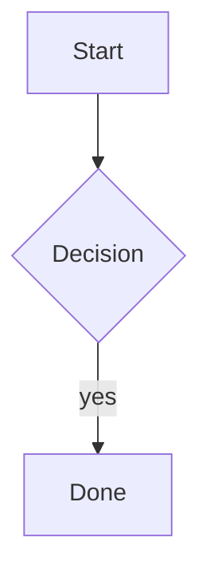
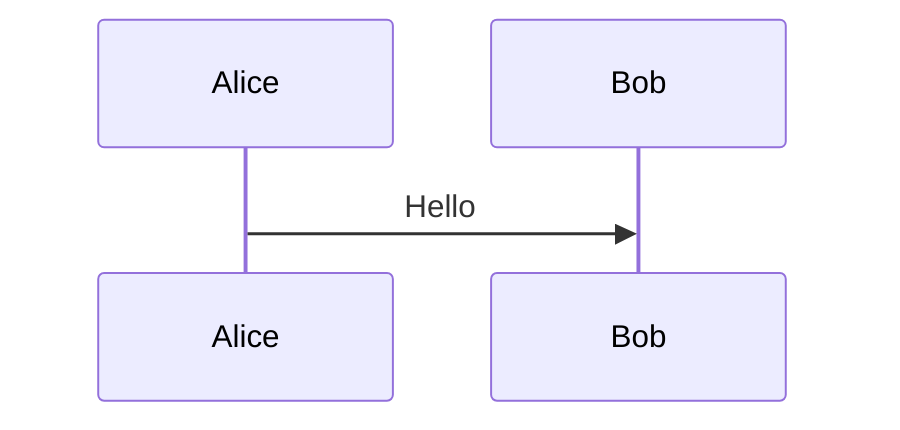
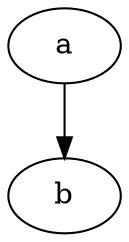
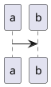

# Diagrams

A diagram that renders:



A second diagram, which the fixture fails on purpose so the fallback path is covered:



The same source twice: it is requested once and drawn at both sites.


A Graphviz diagram:



A formula in a math fence, and the same formula as a dollar block, which is requested once:

```math
\int_0^1 x^2 \, dx = \frac{1}{3}
```

$$
\int_0^1 x^2 \, dx = \frac{1}{3}
$$

Inline dollars are text, not math: it costs $5 and $x^2$ stays as typed.

A fence whose language has no renderer at all falls back to code:


