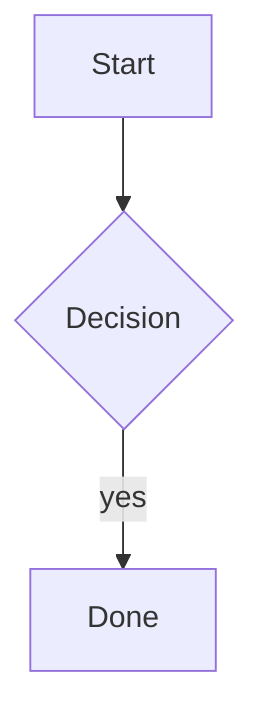
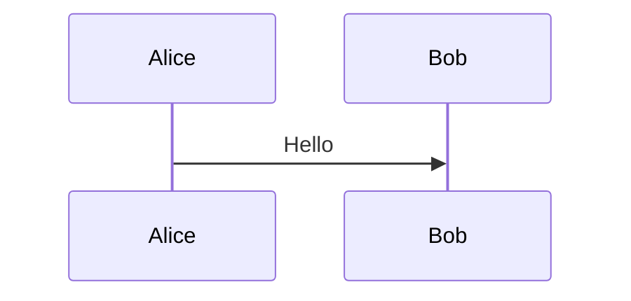
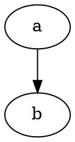
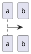

# Diagrams

A diagram that renders:

A second diagram, which the fixture fails on purpose so the fallback path is covered:

The same source twice: it is requested once and drawn at both sites.

A Graphviz diagram:

A fence whose language has no renderer at all falls back to code:

