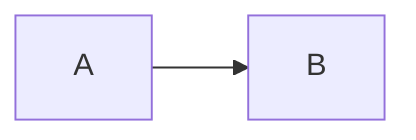

# Kitchen Sink

Every construct the converter supports, in one document.

## Text

Plain text with **bold**, *italic*, ***both***, ~~struck~~, `code`, a
[link](https://example.com), an email <someone@example.com>, and an entity: &amp;.

Characters that stress the escaping: `<`, `>`, `&`, `"`, `'`, and a literal `]]>`.

## Lists

- bullet
  1. nested ordered
  2. and again
- [x] a completed task

## Table

| Column | Value |
|---|---|
| one | 1 |
| two | 2 |

## Code

```python
def greet(name):
    return f"hello {name}"
```

## Images

An image that loads:


An image that does not:


Text before  and text after.

## Diagram



## Quote

> Requirements are the authority where the two documents disagree.
>
> - even with a list inside

## Break

---

Footnoted claim[^one].

[^one]: With a note that has *formatting* of its own.
